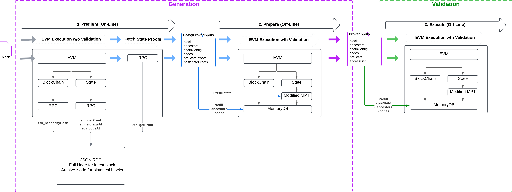

# Prover Inputs Generation

## About Ethereum

On an EVM-compatible chain, any block `B` induces a state transition from `S` to `S'`, where `S` is the pre-state of the parent block and `S'` is the final state after executing the block using the EVM.

In an EVM chain, block transitions are deterministic. Given that every node in the network executes the same blocks starting from the same initial state, every node ends up with the same state at any given block. This forms a decentralized state machine.

### Ethereum State

The EVM state is composed of:

- **Account State (World State):** Contains account data, stored as a Merkle Patricia Trie (MPT), where:
  - **Keys** are the Keccak hash of account addresses.
  - **Values** are the RLP encoding of account data:
    - Balance of the account.
    - Nonce of the account.
    - Code hash of the account (for smart contracts).
    - Storage root of the MPT storage of the account (for smart contracts).
- **Storage for Each Account:** Stored as an MPT, where:
  - **Keys** are the Keccak hash of slot indices.
  - **Values** are the slot values.

The Ethereum state root is the Merkle Patricia root of the account state trie.

### EVM Block Execution

The execution of an EVM block involves various operations, such as processing transactions, handling system calls, and accounting for block rewards. These operations induce state transitions, which can be categorized as follows:

| **Operation**            | **Description**                                                                                                    | **Example**                                                                                      |
|---------------------------|--------------------------------------------------------------------------------------------------------------------|--------------------------------------------------------------------------------------------------|
| **Create an account**     | Create a new account object in the account state trie.                                                             | Deploying a new smart contract.                                                                 |
| **Update an account**     | Update one or more account fields: balance, nonce, or storage hash (note: `codeHash` cannot be changed).           | Updating balance when transferring ETH, updating nonce when executing a transaction, etc.       |
| **SelfDestruct an account** | Delete an account.                                                                                                | Self-destructing a smart contract.                                                              |
| **Create a storage**      | Set an empty storage slot to a non-null value.                                                                     | Any call to `SSTORE(slot, value)` on an empty slot with `value ≠ 0`.                        |
| **Update a storage**      | Set a non-empty storage slot to a non-null value.                                                                  | Any call to `SSTORE(slot, value)` on a non-empty slot with `value ≠ 0`.                     |
| **Delete a storage**      | Set a non-empty storage slot to zero.                                                                              | Any call to `SSTORE(slot, 0)` on a non-empty slot.                                              |

Starting from parent state `S`, applying all state transitions induced by the execution of block `B` results in the final state `S'`. The state root of `S'` is stored in block `B`'s header.

Practically, the final state root is computed by the block proposer and included in the block header. When other nodes receive the proposed block, they re-execute the block on their local state, validate the computed final state root against the one in the block header, and reject the block in case of a mismatch.

### Partial Pre-state and Ancestors

The execution of a block requires accessing only a subset of the pre-state (accounts and storage entries). This subset, called the **partial pre-state**, is significantly smaller than the full pre-state.

Block execution may also optionally require access to some ancestor blocks. For instance, the EVM opcode `BLOCKHASH` enables smart contracts to access the hash of any of the 256 most recent blocks (excluding the current block, as its hash is computed post-execution).

## What Are Prover Inputs?

ZK proving engines operate in isolated environments without access to a full blockchain node. They require sufficient input data to autonomously execute the block, compute the final state root, and validate both the block and the final state.

**Prover Inputs** refer to the minimal data required by a ZK EVM proving engine to effectively prove a block. They include:

- **Block**: The Ethereum block to be executed, including the block header and all transactions.
- **Chain Configuration**: Chain identifier and fork configurations.
- **The Witness**:
  - **Ancestors**: At minimum, the parent header, and optionally all block headers up to the oldest ancestor block accessed during execution (maximum 256 entries).
  - **Codes**: Bytecode of all smart contracts called during execution.
  - **PreState**: The partial pre-state accessed during execution, represented as a list of RLP-encoded MPT nodes (both account and storage tries).
- **AccessList**: A mapping of accessed state entries (accounts and storage) during block execution. This optimizes MPT proof validation ahead of execution.

## Generation of Prover Inputs

### Approach Overview

The current approach retrieves data from a remote Ethereum-compatible JSON-RPC node (full node for recent blocks or archive node for older blocks). This method ensures compatibility across chains exposing the Ethereum JSON-RPC API and is relatively lightweight to maintain. Although it incurs performance overhead due to multiple API calls, it offers an acceptable trade-off given current proving times.

Alternative approaches, such as integrating prover input generation directly within a full node, offer better performance but require new implementations for each EVM chain. This approach is recommended for assessment as proving times improve.

### Generation Flow

Generating Prover Inputs involves three consecutive steps, each requiring EVM block execution:

1. **Preflight**: Executes the block online using a remote RPC backend and generates intermediary `HeavyProverInputs`.
2. **Prepare**: Executes the block offline using a memory backend and optimizes the inputs into final `ProverInputs`.
3. **Execute**: Validates the generated `ProverInputs` by executing the block offline with them.

#### Diagram

#### Step 1: Preflight

This step retrieves necessary data from a remote JSON-RPC node. It runs in an online environment.

It performs a tracked EVM block execution using an RPC backend, which adapts chain and state access into JSON-RPC call as follow

| **Action**                     | **RPC Call**                                     |
|---------------------------------|-------------------------------------------------|
| Access to an account            | `eth_getProof`                                  |
| Opcode `SLOAD`                  | `eth_getStorageAt`                              |
| Opcode `BLOCKHASH`              | Series of `eth_getBlockByHash` calls            |
| Smart contract call             | `eth_getCode`                                   |

The execution tracks all state accesses (accounts and storage slots) to later proof fetching. 

Final state validation is deferred due to missing MPT nodes.

At the end of execution, the preflight fetches proofs for:

- **Pre-state**: All accessed state entries via `eth_getProof(account, accessedSlots, blockNumber)`.
- **Post-state**: Destructed accounts (`eth_getProof(destructedAccount, [], blockNumber)`) and deleted storage slots (`eth_getProof(account, deletedStorage, blockNumber)`).

The intermediary `HeavyProverInputs` contain all proofs, including some unnecessary and redundant data.

#### Step 2: Prepare

This step optimizes `HeavyProverInputs` into final `ProverInputs` offline. It:

- Initializes a chain and state in memory using `HeavyProverInputs` (codes, ancestors, and proofs).
- Executes the block, including final state validation.
- Generates `ProverInputs` based on the witness obtained from execution.

During this step, a modified MPT is used to handle branch node deletions differently.

#### Step 3: Execute

This step validates the generated `ProverInputs` offline. It:

- Initializes a chain and state in memory using `ProverInputs` (codes, ancestors, and preState).
- Executes the block to ensure correct block processing and final state validation.

## Definitions

- **Merkle Patricia Trie**: A data structure combining Merkle trees and Patricia tries, used to efficiently store and verify Ethereum states.
- **EVM**: The Ethereum Virtual Machine, responsible for executing smart contract bytecode.
- **Block**: A unit of data containing transactions, state roots, and metadata, forming the blockchain.
- **State**: The complete data of accounts and storage on the Ethereum blockchain at a given block.
- **Partial Pre-state**: The subset of the state required to execute a block successfully.
- **Account**: An entity in Ethereum that can hold ETH and interact with contracts, represented as an object in the state trie.
- **Storage**: Key-value pairs representing data for smart contracts, stored as MPT nodes.
- **Witness**: Supplemental data ancestors, codes, preState accessed during an EVM block execution validity.

